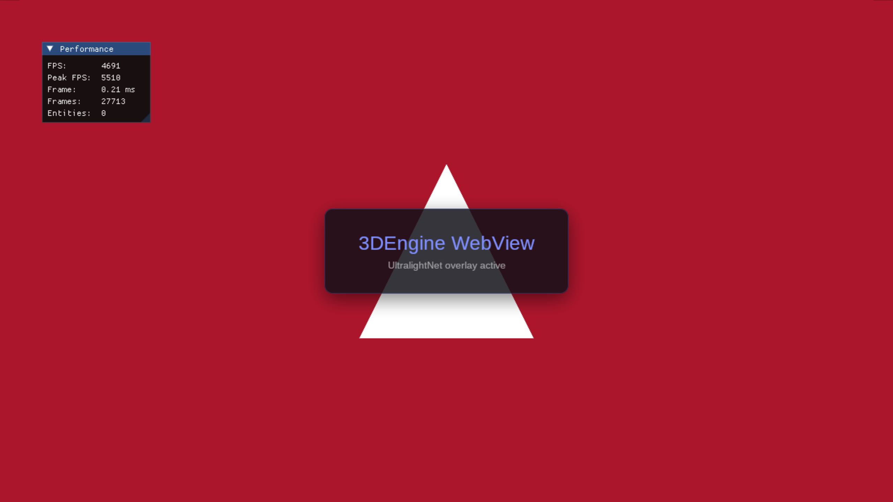

<p align="center" style="text-align:center">
  
</p>

<h1 align="center" style="text-align:center">3D Engine</h1>
<h4 align="center" style="text-align:center">C# 3D Game Engine (Vulkan + SDL3).</h4>
<p align="center" style="text-align:center">Editor built with Blazor Server + Ultralight WebView.</p>

<p align="center" style="text-align:center">
  
  
  
  
</p>

<p align="center" style="text-align:center">
  
  
  <a href="https://discord.gg/c3UtTVNbRb"></a>
  <a href="https://deepwiki.com/CanTalat-Yakan/3DEngine"></a>
</p>

<p align="center" style="text-align:center">
  
</p>

<!-- TOC -->

- [Overview](#overview)
- [Design Goals](#design-goals)
- [Current Status](#current-status)
- [Architecture](#architecture)
- [Features](#features)
    - [Runtime](#runtime)
    - [Editor](#editor)
- [Tech Stack](#tech-stack)
- [Supported Platforms](#supported-platforms)
- [Build and Run](#build-and-run)
- [Quick Start](#quick-start)
- [Roadmap](#roadmap)
- [Contributing](#contributing)
- [License](#license)

### How It Works - see **[ARCHITECTURE.md](ARCHITECTURE.md)**

## Overview

A cross-platform 3D game engine written in C# targeting .NET 10. The runtime is built on **Vulkan** for rendering and
**SDL3** for windowing and input. An editor is included, powered by an in-process **Blazor Server** rendered through an
embedded **Ultralight** WebView overlay composited into the Vulkan pipeline.

The engine features a Bevy-inspired staged execution loop with a **parallel scheduler**, a cache-friendly
**sparse-set ECS**, and an attribute-based **behavior system** driven by a Roslyn source generator. You can author
gameplay logic in two ways:

- **Behavior system** (attribute-based): mark a struct with `[Behavior]`, add methods with stage attributes like
  `[OnUpdate]`, and the generator wires them into the schedule automatically.
- **Native ECS style**: manually add systems to stages and work with `EcsWorld` queries and `EcsCommands`.

## Design Goals

- **Ergonomic ECS** - Lightweight world + staged schedule; attribute-driven behaviors with run
  conditions and keyboard toggles to minimize boilerplate.
- **Explicit Rendering** - Vulkan-first with a structured extract → prepare → queue → graph pipeline; no hidden
  abstractions.
- **Parallel by Default** - Resource-access metadata on `SystemDescriptor` enables automatic parallel batching within
  stages; conservative fallback for unannotated systems.
- **Extensibility** - Plugins compose engine services; source generation handles repetitive registration; typed event
  queues for decoupled communication.
- **Cross-Platform** - Linux, Windows, and macOS (MoltenVK) targeted with minimal platform-specific code in user land.
- **Separation of Concerns** - Runtime (game loop, ECS, renderer) cleanly separated from editor tooling (Blazor Server,
  WebView, hot-reloadable shell scripts).
- **Fast Iteration** - Hot-reload for editor UI via Roslyn-based `ShellCompiler`; inspectable runtime overlays via
  ImGui; structured logging to file and console.

## Current Status

The engine is in **early preview**. Core subsystems are functional but APIs are evolving and breaking changes are
expected.

What works today:

- SDL3 windowing with Vulkan backend and SDL software-renderer fallback.
- Staged update loop with `Startup`, per-frame stages (`First` → `Last`), and `Cleanup`.
- Parallel scheduler with resource-access batching, run conditions, and `ScheduleDiagnostics`.
- Sparse-set ECS with generational entity pool, multi-type queries, zero-allocation ref iterators, change tracking,
  and deferred command buffers.
- Behavior source generator supporting `[With]`/`[Without]`/`[Changed]` filters, `[RunIf]` conditions, and
  `[ToggleKey]` keyboard shortcuts.
- Vulkan graphics device (instance, physical device, logical device, swapchain, pipelines, buffers, images,
  descriptors, sync) via Vortice.Vulkan + VMA. `NullGraphicsDevice` for headless runs and unit tests.
- Render pipeline with extract → prepare → queue → render-graph execution model, including mesh rendering with
  `Camera`, `Mesh`, `Material`, and `Transform` components, opaque/transparent render phases, pipeline caching,
  dynamic buffer allocation, and per-object push constants.
- Asset pipeline with background threaded loading, path deduplication, typed `Assets<T>` storage, `Handle<T>` handles,
  `AssetEvent<T>` lifecycle events, pluggable `IAssetLoader<T>`/`IAssetReader` sources, and hot-reload via file
  watching.
- GLSL → SPIR-V shader compilation (both standalone and as asset via `GlslLoader`) and SPIR-V cross-reflection.
- ImGui runtime overlays (performance HUD, schedule debug HUD, WebView debug HUD).
- Ultralight WebView overlay composited into the Vulkan render pipeline.
- Editor: in-process Blazor Server with hot-reloadable Razor/C# shell scripts, served through the embedded WebView.
- Typed event queues (`Events<T>`, `EventWriter<T>`, `EventReader<T>`).
- Structured multi-provider logging (console + file).
- Unit test suite covering core, ECS, graphics, renderer, and editor subsystems.

See `Engine/Program.cs` for the runtime entry point and `Editor/Program.cs` for the editor entry point.

## Architecture

```text
┌─────────────────────────────────────────────────────────────────┐
│  3DEngine.sln                                                   │
│                                                                 │
│  Engine.Application SDL3 window, input backend, ImGui host      │
│  │                                                              │
│  Engine.Common ─── App, World, Schedule, Config, Logger,        │
│  │                 Events, Time, Input, Stage                   │
│  │                                                              │
│  Engine.Entities ─ EcsWorld, EcsCommands, BehaviorContext,      │
│  │                 Attributes, BehaviorsPlugin                  │
│  │                                                              │
│  Engine.Generator  Roslyn source generator for [Behavior]       │
│  │                                                              │
│  Engine.Files ──── AssetServer, Assets<T>, Handle<T>,           │
│  │                 AssetEvent<T>, IAssetLoader<T>, IAssetReader,│
│  │                 FileAssetReader, FileWatcher, hot-reload     │
│  │                                                              │
│  Engine.Graphics ─ Vulkan device, swapchain, pipelines,         │
│  │                 buffers, images, SPIR-V compilation,         │
│  │                 NullGraphicsDevice (headless/test)           │
│  │                                                              │
│  Engine.Renderer ─ Renderer, RenderGraph, RenderWorld,          │
│  │                 extract/prepare/queue systems, render phases,│
│  │                 Camera/Mesh/Material/Transform components,   │
│  │                 PipelineCache, DynamicBufferAllocator, ImGui │
│  │                                                              │
│  Engine.WebView ── Ultralight integration, WebView overlay      │
│  │                                                              │
│  Engine ────────── Composition root, DefaultPlugins,            │
│  │                 sample behaviors (HUD, stress test)          │
│  │                                                              │
│  Editor ────────── Editor entry point, ShellCompiler host       │
│  Editor.Server ─── Blazor Server (in-process), Razor pages      │
│  Editor.Shell ──── Shell registry, descriptors, builders        │
│  Editor.Compiler ─ Roslyn hot-reload compiler for shells        │
│  │                                                              │
│  Tests ─────────── xUnit tests (Common, Entities, Graphics,     │
│                     Renderer, Editor)                           │
└─────────────────────────────────────────────────────────────────┘
```

## Features

### Runtime

- **Staged update loop** - `Startup` (once) → `First` → `PreUpdate` → `Update` → `PostUpdate` → `Render` → `Last`
  (per frame) → `Cleanup` (once on exit).
- **Parallel scheduler** - Systems within a stage run in parallel batches based on declared `Read<T>`/`Write<T>`
  resource-access metadata. `ScheduleDiagnostics` provides per-stage and per-system timing.
- **Cache-friendly ECS** - Sparse-set storage, generational entity pool, per-frame bitset change tracking,
  zero-allocation ref iterators, multi-type queries (up to 3), `TransformEach`, `ParallelTransformEach`, and raw span
  access.
- **Behavior source generator** - `[Behavior]` structs with stage attributes (`[OnStartup]` through `[OnCleanup]`),
  component filters (`[With]`, `[Without]`, `[Changed]`), run conditions (`[RunIf]`), and keyboard toggles
  (`[ToggleKey]`).
- **Deferred commands** - `EcsCommands` queue spawn/despawn/add/remove operations, flushed automatically at
  `PostUpdate`.
- **Typed event system** - `Events<T>` queues with `EventWriter<T>` and `EventReader<T>` for decoupled, type-safe
  inter-system communication.
- **Plugin model** - `DefaultPlugins` aggregates: `AssetPlugin`, `AppWindowPlugin`, `AppExitPlugin`,
  `ExceptionsPlugin`, `TimePlugin`, `InputPlugin`, `EcsPlugin`, `BehaviorsPlugin`, `SdlImGuiPlugin`,
  `SdlRendererPlugin`, `VulkanWebViewPlugin`, `VulkanImGuiPlugin`. Also registers `GlslLoader` with the `AssetServer`.
- **Vulkan graphics device** - Instance creation, physical device selection, logical device, swapchain management,
  pipeline creation, buffer/image allocation (VMA), descriptor sets, and synchronization primitives.
  `NullGraphicsDevice` provides a no-op implementation for headless runs and unit tests.
- **Render pipeline** - Extract → BeginFrame → Prepare → Graph execution (Update → auto-barrier → Run per node) →
  EndFrame. Built-in extract systems (`CameraExtract`, `MeshMaterialExtract`, `ClearColorExtract`), prepare systems
  (`MeshPrepare`, `QueueMeshPhaseItems`), and the `MainPassNode` with mesh shader pipeline, per-object push constants
  (`MeshPushConstants`), camera UBO, and `ActiveSwapchainPass` pattern (pass stays open for overlay nodes). Render
  components: `Camera`, `Mesh`, `Material`, `Transform`, `RenderMeshInstance`, `ExtractedView`. Render phases:
  `Opaque3dPhase` (front-to-back), `Transparent3dPhase` (back-to-front) with `IPhaseItem` and `IDrawFunction<T>`.
  GPU resource management: `PipelineCache` for deduplicating compiled pipelines, `DynamicBufferAllocator` for
  frame-scoped transient GPU buffers, `MeshGpuRegistry` for caching uploaded vertex buffers.
- **Asset pipeline** - `AssetServer` with background threaded loading, path deduplication, typed `Assets<T>` storage,
  `Handle<T>` handles, `AssetEvent<T>` lifecycle events (`Added`, `Modified`, `LoadedWithDependencies`), pluggable
  `IAssetLoader<T>` / `IAssetReader` sources (`FileAssetReader`, `EmbeddedAssetReader`), dependency tracking, and
  hot-reload via `FileAssetWatcher`. Built-in loaders: `ByteArrayLoader`, `StringLoader`, `GlslLoader` (GLSL → SPIR-V
  as asset).
- **Shader pipeline** - GLSL → SPIR-V compilation via `Vortice.ShaderCompiler`; SPIR-V cross-reflection via
  `Vortice.SpirvCross`.
- **ImGui overlays** - Performance HUD (FPS, frame time, entity count), schedule debug HUD (batch composition,
  conflict notes), and WebView debug HUD. Togglable via `[ToggleKey]`.
- **WebView overlay** - Ultralight-based HTML/CSS/JS rendering composited into the Vulkan pipeline with full SDL3
  input forwarding.
- **Structured logging** - Multi-provider logging (console with ANSI colors, file output) with category scoping,
  severity levels (`Trace` through `Critical`), and frame-level trace suppression.

### Editor

- **Blazor Server** - In-process ASP.NET Core host serving a Razor component tree over SignalR WebSocket.
- **Embedded WebView** - Ultralight renders the Blazor UI directly inside the SDL3/Vulkan engine window.
- **Hot-reloadable shells** - `ShellCompiler` watches `.cs`/`.razor`/`.css` files, recompiles via Roslyn on change,
  and hot-swaps editor panels without restarting.
- **Shell registry** - `ShellRegistry` + `ShellDescriptor` system for dynamically discovered editor panels and
  inspectors.
- **Single process** - Engine and editor run in one process; Blazor Server on a background thread, SDL3/Vulkan on the
  main thread.

## Tech Stack

| Component | Library / Package | Purpose |
|---|---|---|
| Windowing & Input | [SDL3-CS](https://github.com/ppy/SDL3-CS) (preview) | Cross-platform window, input, audio |
| GPU API | [Vortice.Vulkan](https://github.com/amerkoleci/Vortice.Vulkan) 3.2.1 | Vulkan bindings |
| Memory Allocator | Vortice.VulkanMemoryAllocator 1.7.0 | GPU memory management (VMA) |
| Shader Compilation | Vortice.ShaderCompiler 1.9.0 | GLSL → SPIR-V |
| Shader Reflection | Vortice.SPIRV 1.0.5 + Vortice.SpirvCross 1.5.4 | SPIR-V cross-reflection |
| Debug UI | Twizzle.ImGui-Bundle.NET 1.91.5.2 | ImGui runtime overlays |
| Asset Import | AssimpNet 5.0.0-beta1 | 3D model import (FBX, glTF, OBJ, …) |
| Scene Interchange | UniversalSceneDescription 6.0.0 | USD scene format |
| WebView | UltralightNet (vendored) | HTML/CSS/JS overlay in Vulkan |
| Editor UI | BlazorBlueprint Components | Blazor component library |
| Hot Reload | Editor.Compiler (Roslyn-based) | Runtime recompilation of shell scripts |
| Serialization | Newtonsoft.Json 13.0.5 | Configuration and data serialization |
| Source Generator | Engine.Generator (Roslyn) | `[Behavior]` system code generation |

## Supported Platforms

| Platform | Status | Notes |
|---|---|---|
| **Linux** | Supported | X11 and Wayland via SDL3. Requires recent Vulkan drivers (Mesa / NVIDIA / AMD). |
| **Windows** | Supported | Vulkan-capable GPU + drivers. |
| **macOS** | Experimental | Via MoltenVK (Vulkan portability). |

## Build and Run

**Prerequisites:**

- [.NET 10 SDK](https://dotnet.microsoft.com/download) (preview SDK may be required).
- A working Vulkan driver/runtime for your GPU.

**Clone and build:**

```bash
git clone https://github.com/CanTalat-Yakan/3DEngine.git
cd 3DEngine

# Restore and build all projects
dotnet build

# Run the engine runtime
dotnet run --project Engine

# Run the editor
dotnet run --project Editor
```

Open in an IDE (Rider / Visual Studio / VS Code) using `3DEngine.sln`.

**Run tests:**

```bash
dotnet test
```

**Notes:**

- Native binaries for SDL3, ImGui, and Ultralight are bundled via NuGet. On Linux you still need standard system
  libraries (X11/Wayland, audio, etc.) and up-to-date GPU drivers.
- If Vulkan initialization fails, verify your driver installation and ensure validation layers are either installed or
  disabled.
- The editor requires the Blazor Server port (`http://localhost:5000` by default) to be available.

## Quick Start

### Behavior-based (automatic)

```csharp
[Behavior]
public struct Spinner
{
    public float Angle;

    [OnStartup]
    public static void Spawn(BehaviorContext ctx)
    {
        var e = ctx.Ecs.Spawn();
        ctx.Ecs.Add(e, new Spinner { Angle = 0f });
    }

    [OnUpdate]
    public void Tick(BehaviorContext ctx)
    {
        Angle += (float)ctx.Time.DeltaSeconds * 90f;
        Console.WriteLine($"Entity {ctx.EntityId} angle: {Angle:0.00}°");
    }
}
```

1. Add the struct to any project that references `Engine.Entities`.
2. Build - the source generator emits systems automatically.
3. Run - the behavior executes per entity each frame. No manual registration needed.

### Plugin-based (manual)

```csharp
var config = Config.GetDefault(
    title: "My Game",
    width: 1280,
    height: 720,
    graphics: GraphicsBackend.Vulkan);

new App(config)
    .AddPlugin(new DefaultPlugins())
    .AddPlugin(new GamePlugin())
    .Run();

public sealed class GamePlugin : IPlugin
{
    public void Build(App app)
    {
        app.AddSystem(Stage.Startup, world =>
        {
            var ecs = world.Resource<EcsWorld>();
            var e = ecs.Spawn();
            ecs.Add(e, new Spinner { Angle = 0f });
        });

        app.AddSystem(Stage.Update, new SystemDescriptor(world =>
        {
            var ecs = world.Resource<EcsWorld>();
            var time = world.Resource<Time>();
            foreach (var (e, spinner) in ecs.Query<Spinner>())
            {
                var s = spinner;
                s.Angle += (float)time.DeltaSeconds * 45f;
                ecs.Update(e, s);
            }
        }, "GamePlugin.SpinnerUpdate")
        .Read<Time>()
        .Write<EcsWorld>());
    }
}
```

## Roadmap

### Implemented

- Platform layer (SDL3 windowing, input, timing)
- Vulkan device initialization, swapchain, VMA allocations
- `NullGraphicsDevice` for headless runs and unit tests
- Render pipeline (extract/prepare/queue/graph model) with mesh rendering
- Render components: Camera, Mesh, Material, Transform
- Render phases (opaque front-to-back, transparent back-to-front)
- GPU resource management: PipelineCache, DynamicBufferAllocator, MeshGpuRegistry
- SPIR-V shader compilation and reflection
- Asset pipeline: AssetServer, background loading, typed storage, handle deduplication, hot-reload
- Built-in asset loaders (ByteArray, String, GlslLoader)
- Sparse-set ECS with generational entity pool and change tracking
- Behavior source generator with filters, run conditions, toggle keys
- Parallel scheduler with resource-access batching
- ImGui runtime overlays
- WebView overlay (Ultralight + Vulkan compositing)
- Editor scaffolding (Blazor Server, hot-reloadable shells)
- Typed event system
- Structured logging (console + file)
- Unit test suite (Common, Entities, Graphics, Renderer, Editor)

### In Progress

- Material system with PBR shading and lighting
- Scene graph and serialization (USD integration)
- Editor tools: dockable panes, inspectors, scene view, property editors

### Planned

- Asset import loaders (Assimp: FBX, glTF, OBJ), texture loaders, asset packaging and caching
- Compute workloads (culling, particles, post-processing)
- Audio system
- Physics integration
- Networking
- Shader hot-reload
- CI/CD: cross-platform builds, automated formatting, linting
- Comprehensive documentation and samples

Items are aspirational and subject to change as the project evolves.

## Contributing

Early days! If you want to help:

- Try building and running on your platform and open issues for any rough edges.
- Propose small, well-scoped PRs (build scripts, docs, samples, or isolated subsystems).
- Keep changes platform-agnostic when possible.

By participating, you agree to abide by our [Code of Conduct](./.github/CODE_OF_CONDUCT.md).

## License

Code: MPL-2.0 license. See [LICENSE](./LICENSE) for the full text.

Contributions: By submitting a contribution, you agree to license your contribution under the same license as this
repository.
