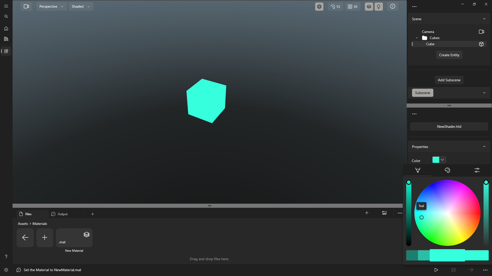
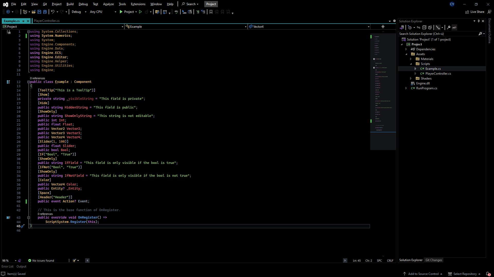
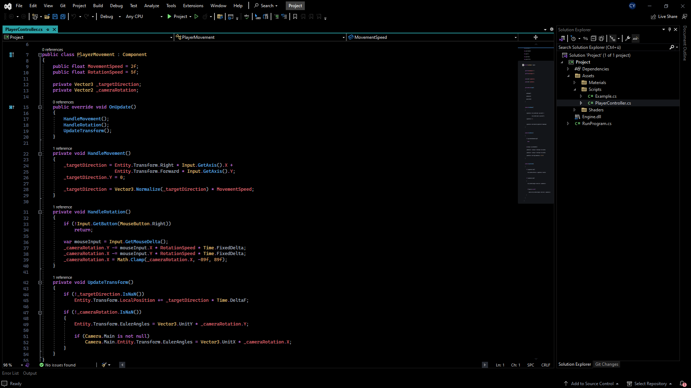

 
# [3D Engine - Get it in the Microsoft Store-App](https://www.microsoft.com/store/apps/9NFSX6JPV0PS)
[⠀WIKI⠀](https://3DEngine.Wiki) [⠀DOCS⠀](https://engine3d.gitbook.io/documentation/)

# Windows App SDK

| Delight users with modern UI | Access new platform features | Backwards compatible |
|:--:|:--:|:--:|
|  Powerful WinUI 3 UI |  Localization + power status + more  |  Down to Windows 10 1809 |

...and more, **without having to rewrite your app!**

* Use your current installer *(no requirement to use MSIX, but there are [reliability/security benefits to using MSIX](https://docs.microsoft.com/windows/msix/overview#key-features)!)*
* Additive platform APIs *(only add what you need, leave the rest of your app as-is)*
* Works with Win32, WPF, WinForms, and more apps

Plus, **create beautiful, modern apps for Windows 11 that are backwards compatible** to Windows 10 October 2018 Update (build 17763 / version 1809)!

# Vortice.Windows

[Vortice.Windows](https://github.com/amerkoleci/Vortice.Windows) is a collection of Win32 and UWP libraries with bindings support for [DXGI](https://docs.microsoft.com/en-us/windows/desktop/direct3ddxgi/d3d10-graphics-programming-guide-dxgi), [WIC](https://docs.microsoft.com/en-us/windows/desktop/wic/-wic-lh), [DirectWrite](https://docs.microsoft.com/en-us/windows/desktop/directwrite/direct-write-portal), [Direct2D](https://docs.microsoft.com/en-us/windows/desktop/direct2d/direct2d-portal), [Direct3D9](https://docs.microsoft.com/en-us/windows/win32/direct3d9/dx9-graphics), [Direct3D11](https://docs.microsoft.com/en-us/windows/desktop/direct3d11/atoc-dx-graphics-direct3d-11), [Direct3D12](https://docs.microsoft.com/en-us/windows/desktop/direct3d12/directx-12-programming-guide), [XInput](https://docs.microsoft.com/en-us/windows/win32/xinput/getting-started-with-xinput), [XAudio2](https://docs.microsoft.com/en-us/windows/win32/xaudio2/xaudio2-introduction), [X3DAudio](https://docs.microsoft.com/it-it/windows/win32/xaudio2/x3daudio), [DirectInput](https://docs.microsoft.com/en-us/previous-versions/windows/desktop/ee416842(v=vs.85)), [DirectStorage](https://devblogs.microsoft.com/directx/landing-page/), [DirectML](https://docs.microsoft.com/en-us/windows/ai/directml/dml-intro), [UIAnimation](https://docs.microsoft.com/en-us/windows/win32/api/_uianimation) and [DirectSound](https://learn.microsoft.com/en-us/previous-versions/windows/desktop/bb318665(v=vs.85)).

This library targets **.net7.0** and **.net8.0** and uses modern C# 12, see [CHANGELOG](https://github.com/amerkoleci/Vortice.Windows/blob/main/CHANGELOG.md) for list of changes between commits.

If you are looking for high-performance low level bindings, please visit [Vortice.Win32](https://github.com/amerkoleci/Vortice.Win32)

# Entity Component System (ECS)

The Entity Component System is an architectural pattern often used in video game development. It facilitates code reusability by separating the data from the behavior. In addition, ECS obeys the "composition over inheritance principle," providing improved flexibility and helping developers identify entities in a game's scene where all the objects are classified as entities. One reason ECS is faster than a game object component system is that you put all the data you need together in the same place in memory. Doing so avoids the performance overhead of having to search around to find it.

# Upcoming Features and Development Roadmap

* Materials
* Render Textures,
* Post-Processing,
* Gizmos,
* Asynchronous Reprojection
* Lumen (Erebus, Aruna)
* Nanite (Nano Tech).

# Build
In order to compile, you need to install [Visual Studio 2022 Preview](https://visualstudio.microsoft.com/vs/preview/) with the following components:

*  [Windows 11 SDK](https://developer.microsoft.com/en-us/windows/downloads/windows-sdk)
*  [Windows App SDK](https://learn.microsoft.com/en-us/windows/apps/windows-app-sdk/downloads)
*  [.NET 8.0 SDK](https://dotnet.microsoft.com/en-us/download/dotnet/8.0)

*Rolled back to .Net 7 and VS2022 for now, because it lead to errors due to the WinAppSDK and the newest .Net 8 SDK Preview RC that gets installed with the Visual Studio Preview Workload of the .Net Environment!*

# Screenshots

